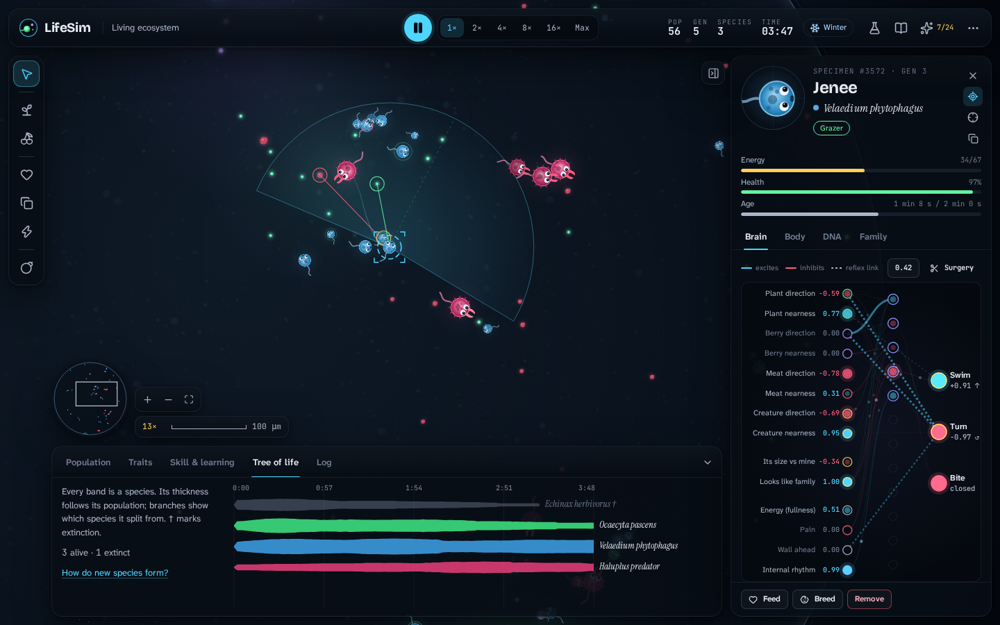

# LifeSim

**Evolve minds in a petri dish.** LifeSim is an educational evolution game that runs in the browser. Every creature has a body built from **DNA** and a small **neural-network brain**. They graze, hunt, learn and breed. Each generation, natural selection reshapes their bodies and rewires their brains. You can watch it happen, look inside any creature, and change the rules.



## What you can do

- **Watch evolution happen live.** Creatures that find food have more babies, and their DNA spreads. Start from random brains in *Primordial soup* and watch a measured foraging-skill score climb from about 2 to 25+ plants per minute.
- **Play as a creature (Adventure mode).** Design a body from DNA: size, muscle, diet, eyes, brain and more. Every slider shows its trade-offs (speed, energy burn, lifespan). Then swim, eat and fight with the keyboard, mouse or touch. When you are a well-fed adult, lay eggs. You spend the evolution points you earned to redesign the baby you will play next. Its brothers and sisters get random mutations instead and breed on their own, so your designs compete with natural selection. If you die, carry on as any living member of your bloodline. Goals guide you from your first meal to a ten-generation dynasty. All the while, a readout shows what your creature's own neural network *wants* to do. Switch on autopilot to let it drive.
- **Look inside a brain.** Click any creature to see its 14 senses, up to 12 hidden neurons and 3 actions firing in real time. Hover anything for an explanation. LifeSim probes the network and describes its instincts in plain words ("Steers toward plants", "Bites strangers but spares its family").
- **Perform brain surgery.** Change, flip or cut any connection, or switch neurons off, then watch the behaviour change. Optionally write the change into its DNA so its babies inherit it.
- **Read its DNA.** A heat map of all 275 genes shows which came from the mother, which from the father, and which are fresh mutations. Copy any creature's DNA code and release it into another world.
- **Trace family trees.** Follow the maternal line back to the founders, count living descendants, and find the common ancestor of every creature alive.
- **See learning beat instinct.** In *Poison berries*, two species start with the same instincts. One can learn from a bad meal; the other can't. In every test world, the species that can't learn died out.
- **Play god (or farmer).** Grow food, feed or breed your favourites (artificial selection), remove creatures, strike a meteor (mass extinction), and change seasons, mutation strength, predation and more from the Lab controls.
- **Learn the ideas.** Six guided Academy lessons, a Neuron Lab where you steer a creature with a single neuron, a 33-entry Field Guide, and 24 discoveries that unlock when your world demonstrates an idea.

## Run it

You need Node.js 20 or newer.

```bash
npm install
npm run dev        # http://localhost:5173
```

Other scripts:

| Command | What it does |
| --- | --- |
| `npm run build` | Type-checks and builds a static site into `dist/` (deploy it anywhere). |
| `npm run build:single` | Builds one self-contained HTML file into `dist-single/`. |
| `npm test` | Runs the simulation unit tests (Vitest). |
| `npm run evolve -- --minutes 30 --seed 3` | Runs a world headless, as fast as possible, and prints its vital signs. Used to tune the ecosystem. |

### Deploy to GitHub Pages

The workflow in `.github/workflows/deploy.yml` builds and publishes the site whenever `main` changes. To switch it on, open the repository's **Settings → Pages** and set **Source** to **GitHub Actions**. The game will then be live at `https://<user>.github.io/lifesim/`.

## How the simulation works

Everything is a real idea from biology or computer science, simplified so you can see it.

**Bodies & genes.** A genome has 14 body genes (size, muscle, colour, diet, eyesight, field of view, growth time, breeding threshold, baby size, mutation rate, learning rate, rhythm, markings, brain size) and 261 brain genes (connection weights). Traits trade off against each other. Big bodies store more energy but burn more (metabolism scales with mass^¾, Kleiber's law). Wide eyes see more but aim less precisely. Every hidden neuron costs energy.

**Brains.** Each creature runs a feed-forward network 30 times per simulated second. The inputs are the direction and nearness of the closest plant, berry, meat and creature in view, plus the other creature's relative size, how family-like it looks, hunger, pain, the wall ahead and an internal rhythm. They feed through up to 12 tanh hidden neurons and direct "reflex" links to three outputs: swim, turn and bite.

**Learning during life.** Creatures with the learning gene keep a learned liking for plants, berries and meat. Tasty meals turn it up and poison turns it down. The liking scales every connection leaving that food's eye neurons, so below zero the wiring flips and the creature steers away. Learned likings are not inherited (unless you switch on the Lamarckian experiment).

**Reproduction & evolution.** Well-fed adults breed. If a mate of the same species is nearby, the baby's DNA mixes both parents. Body genes cross over one by one, brain genes one neuron at a time. Then random mutations are applied. Nothing in the code says what a good creature is: more food simply means more babies.

**Species.** A lineage that drifts far enough from its parent species becomes a new species, with a Latin name describing what changed (*velox* = fast, *oculatus* = sharp-eyed).

**Ecology.** Plants grow in drifting fertile patches, faster in summer than in winter. Corpses become meat. Hunters, grazers and seasons produce boom-and-bust cycles. If the population collapses, the lab's life support revives a successful genome from its gene bank (you can switch this off).

**Measuring intelligence.** Population size says little about how smart brains are, so a plant-eater's brain is regularly copied into an identical test arena and its plants-per-minute are recorded. That's the Skill chart.

## Architecture

No game engine is needed. The simulation is plain TypeScript, which keeps it fast, testable and easy to read.

```
src/
  sim/        Simulation engine, pure TypeScript, no DOM
    world.ts       the world: food, senses, physics, metabolism, breeding, predation
    genome.ts      DNA: genes, mutation, crossover, distance, DNA codes
    brain.ts       neural network + taste learning
    species.ts     speciation and Latin names
    instincts.ts   plain-language behaviour analysis by probing the network
    tuning.ts      every "law of nature" in one place
  render/     Canvas 2D microscope renderer (sprites, effects, camera, minimap)
  app/        Controller (animation loop, tools), UI store, discoveries, saving, adventure mode
  ui/         React interface (inspector, brain view, charts, lessons, modals)
  content/    Field Guide, lessons, scenarios, discoveries and adventure goals, as plain data
scripts/      Headless evolution runner
tests/        Vitest unit tests for the engine
```

- **Fixed time step.** The world advances in steps of 1/30 s. Speed-ups run more steps per frame within a 13 ms budget, so the interface stays responsive. "Max" runs as fast as the machine allows.
- **Spatial hashing** keeps sensing and collisions fast with hundreds of creatures.
- **Seeded randomness.** The same seed and settings produce the same world, so experiments are repeatable.
- **Saving.** Worlds are saved in this browser's IndexedDB (gzip-compressed) every minute and when you leave.
- **React** renders the panels a few times per second. The dish and the brain view draw on canvases every frame.

## License

LifeSim is released under the [MIT License](LICENSE).

## Credits

Typefaces, all under the SIL Open Font License, bundled with [Fontsource](https://fontsource.org): Bricolage Grotesque, Atkinson Hyperlegible Next, Instrument Serif and JetBrains Mono. Icons by [Lucide](https://lucide.dev).
